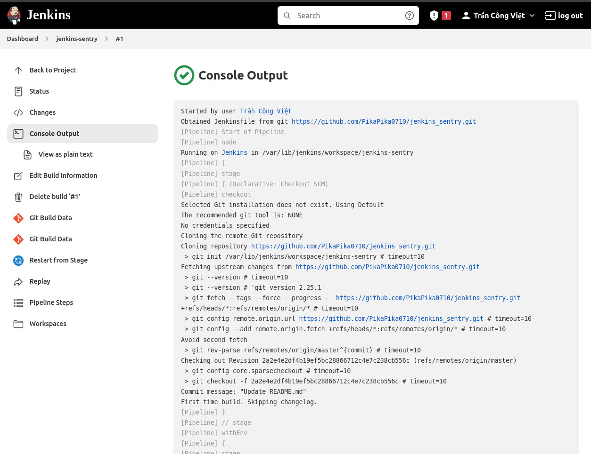
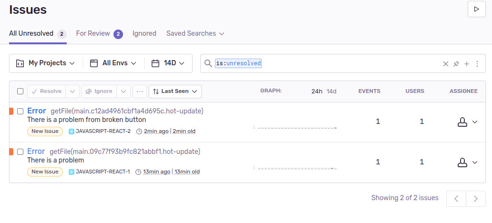

# jenkins-sentry
Learning Jenkins CI-CD and Sentry.io
 
Jenkins: https://www.youtube.com/playlist?list=PLlahAO-uyDzJ7sWdvD_j0eyvbKtf-1quq

Sentry: https://www.youtube.com/watch?v=WEMm9SgB_N0&ab_channel=ProgrammingWithPrem

# Demo

Jenkins - Github:

Sentry logs: https://sentry.io/

